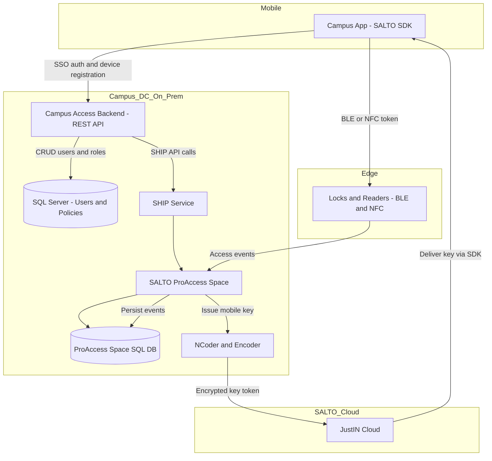
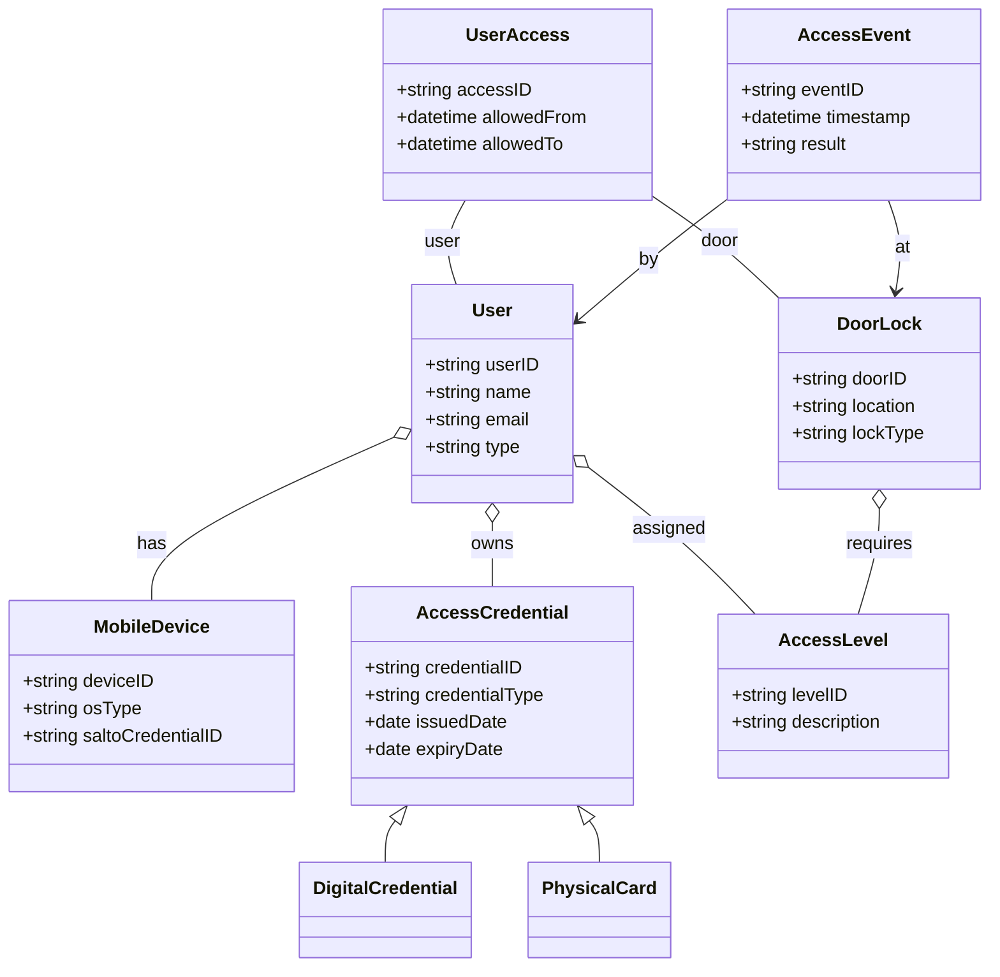
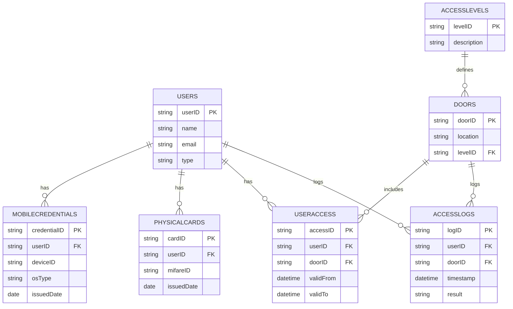

# Mobile App Specification: Integrated Campus ID & SALTO Access

**Version:** 1.0
**Date:** 2025-10-16
**Author:** @waldonhendricks

---

## 1. Introduction

### 1.1. Project Overview
This document outlines the design and specifications for a mobile application that will serve as a digital campus ID. The project's primary goal is to replace or supplement the existing MIFARE Classic 4K contactless cards used by campus staff and students for physical access control. The new system will leverage the SALTO ProAccess Space infrastructure and SALTO's JustIN Mobile technology to provide a secure, convenient, and scalable mobile credentialing solution.

### 1.2. Purpose
The mobile application will provide users with a digital version of their campus ID on their smartphones. This digital ID will contain an encrypted access key, allowing users to unlock permitted doors by presenting their phone to SALTO electronic readers. This initiative aims to enhance user convenience, improve security, and create a platform for future "one-card" services like printing and payments.

### 1.3. Scope
**In-Scope:**
*   Development of native mobile applications for Android and iOS using the SALTO SDK.
*   User registration, authentication (via campus SSO), and device enrollment.
*   Secure issuance, storage, and management of digital access keys (JustIN Mobile credentials).
*   Door unlocking functionality via Bluetooth Low Energy (BLE) for both platforms and Near Field Communication (NFC) for Android.
*   Integration with the on-premises SALTO ProAccess Space backend via the SALTO Host Interface Protocol (SHIP) for user and permission synchronization.
*   A fallback process for issuing physical MIFARE cards to users without a compatible smartphone.
*   Logging of all access events (granted and denied) for auditing purposes.

**Out-of-Scope (for initial release):**
*   Integration with other campus services such as printing, payments, dining, etc.
*   Administrative user interface within the mobile app. (Administration will be handled via the existing SALTO Space GUI).

---

## 2. System Architecture

The system is built upon the existing SALTO Space access control platform, extended with mobile access capabilities.

### 2.1. Architectural Components
1.  **Mobile App (Android/iOS):** A native application built with the SALTO SDK. It securely stores the user's digital credential, communicates with the backend to receive keys, and interacts with door readers via BLE/NFC. The app will use the provided SALTO security certificates for Android and iOS to authenticate with the SALTO cloud infrastructure.
2.  **Backend Server:** An on-premises server hosting a SQL Server database. This server manages campus user profiles, authenticates users, and interfaces with the SALTO Space server via the SHIP protocol to synchronize user data and trigger key issuance.
3.  **SALTO ProAccess Space Server:** The core on-site SALTO server that manages the SQL database of doors, users, access levels, and events. It controls online door hardware and communicates with the NCoder.
4.  **SALTO JustIN Cloud:** A cloud-based service that securely delivers the encrypted digital keys from the SALTO backend to the user's mobile app.
5.  **SALTO NCoder:** A hardware device used to securely generate and encrypt digital keys (and program physical cards). The encryption ensures that keys can only be decrypted by the intended SALTO lock.
6.  **Electronic Locks & Readers:** SALTO door hardware equipped with BLE and/or RFID/NFC readers that validate credentials and grant or deny access.

### 2.2. Architectural Flow
The architecture enforces end-to-end security and a clear separation of duties between the campus backend (local server with SQL Server and SALTO Space), SALTO Cloud (for mobile key delivery), and the mobile client.

High-level flow:

1) App bootstrap and device enrollment
- User signs in via campus SSO in the mobile app.
- App registers the device; backend stores device + user mapping in its SQL Server DB and associates the campus user with the SALTO "Person" record/identifier.

2) Key provisioning (JustIN Mobile)
- Backend calls SALTO Space via SHIP to create/update the user, assign access levels, and request issuance of a JustIN Mobile key.
- SALTO Space and the NCoder/encoder service generate an end-to-end encrypted mobile key token.
- The encrypted key token is handed to SALTO JustIN Cloud, which queues it for delivery to the mobile device.
- The mobile app (via SALTO SDK and platform-specific SALTO certificates) connects to JustIN Cloud and securely downloads the key, storing it in secure storage (Keychain/Keystore).

3) Door unlock
- User activates unlock; the app uses the SALTO SDK to present the key over BLE (iOS/Android) or NFC (Android) to the reader/lock.
- The lock decrypts and validates the token against its permissions and access level; if valid, it grants access.

4) Event logging and synchronization
- Locks/readers record access events. Online doors forward events to SALTO Space immediately; offline doors buffer and sync later.
- SALTO Space persists events in its SQL database. The campus backend can query/pull events via SHIP for analytics or cross-system audit if required.

5) Changes, revocation, and fallback
- When a user’s role/status changes, the backend updates SALTO Space via SHIP. Space invalidates old keys and issues new ones as needed; JustIN Cloud propagates changes to devices.
- If a user lacks a compatible phone, the backend triggers card issuance; SALTO encoders personalize a MIFARE Classic 4K card aligned to the same access profile.

Trust boundaries and transports:
- App ↔ Backend: HTTPS (mutual TLS optional); no keys pass through the backend.
- Backend ↔ SALTO Space (SHIP): Authenticated channel within campus network.
- App ↔ JustIN Cloud: SALTO SDK using vendor-provided platform credentials.
- App ↔ Locks: BLE/NFC; payloads are SALTO-encrypted tokens only the target lock can decrypt.

The following diagram summarizes the flow and data paths:

---

## 3. Data & Process Flows

### 3.1. User & Data Workflow
The end-to-end process for a user to gain access is as follows:

1.  **User Enrollment:** A new user downloads the app and authenticates using their campus Single Sign-On (SSO) credentials. The app registers the device with the backend server. The backend verifies the user's status and assigns the appropriate access level.
2.  **Digital Key Issuance:** The backend server instructs the SALTO Space system (via SHIP) to generate a JustIN Mobile key for the user. The SALTO NCoder creates an encrypted key token.
3.  **Key Delivery:** The encrypted key is delivered securely to the user's mobile app via the SALTO JustIN Cloud. The app stores the key in its secure storage.
4.  **Door Unlocking:** The user approaches a door and activates the unlock function in the app (or via a widget). The phone transmits the key to the SALTO reader using BLE or NFC. The reader decrypts the key, verifies permissions, and unlocks the door if the credential is valid.
5.  **Event Logging:** The door lock records the access attempt (success or failure) and syncs this event back to the SALTO Space server, creating an audit trail.
6.  **Permission Updates:** When an administrator changes a user's access rights in the central system, the backend pushes this update to SALTO via SHIP. The user's credential is automatically updated the next time they use it at an online reader.

### 3.2. Sequence Diagram: Door Unlock
This diagram illustrates the interaction between components during an unlock event.

---

## 4. Data Model

### 4.1. Class Diagram
The system's object model is composed of the following primary classes:
*   **User:** Represents a student or staff member with attributes like `userID`, `name`, and `type`.
*   **MobileDevice:** Represents a user's registered smartphone, identified by `deviceID` and `osType`.
*   **AccessCredential:** An abstract representation of a credential, which can be a `DigitalCredential` (JustIN Mobile) or a `PhysicalCard` (MIFARE).
*   **AccessLevel:** A defined set of permissions (e.g., "Staff," "Dorm Resident").
*   **DoorLock:** Represents a physical door with a specific `location` and `requiredLevel`.
*   **AccessEvent:** A log entry for every access attempt, containing `timestamp`, `userID`, `doorID`, and `result`.

Diagram:

### 4.2. Entity-Relationship Diagram (ERD)
The database schema will include the following core entities to support the application:

*   **Users** (`userID` PK, `name`, `email`, `type`)
*   **MobileCredentials** (`credentialID` PK, `userID` FK, `deviceID`, `osType`, `issuedDate`)
*   **PhysicalCards** (`cardID` PK, `userID` FK, `mifareID`, `issuedDate`)
*   **AccessLevels** (`levelID` PK, `description`)
*   **Doors** (`doorID` PK, `location`, `levelID` FK)
*   **UserAccess** (`accessID` PK, `userID` FK, `doorID` FK, `validFrom`, `validTo`)
*   **AccessLogs** (`logID` PK, `userID` FK, `doorID` FK, `timestamp`, `result`)

ERD Diagram:

---

## 5. Technical Specifications

### 5.1. Mobile Application
*   **Platforms:** Android, iOS.
*   **SDK:** SALTO Mobile SDK for Android and iOS.
*   **Communication:**
    *   **Backend:** Secure RESTful APIs over HTTPS.
    *   **Door Readers:** Bluetooth Low Energy (BLE) on iOS and Android; Near Field Communication (NFC) on Android.
*   **Security:**
    *   Utilizes SALTO-provided credentials (certificates) for authenticating with the JustIN Cloud.
    *   Secure storage of digital keys on the device.
    *   End-to-end encryption for all key-related communications as provided by the SALTO ecosystem.

### 5.2. Backend
*   **Server:** On-premises local server.
*   **Database:** SQL Server.
*   **Integration Protocol:** SALTO Host Interface Protocol (SHIP) for communication with the SALTO ProAccess Space server.

---

## 6. Sources
*   SALTO Systems Documentation (support.saltosystems.com, saltosystems.com)
*   NXP MIFARE Product Information (nxp.com)
*   Campus Safety Magazine (campussafetymagazine.com)
*   UML & System Design Guides (ibm.com, geeksforgeeks.org, lucidchart.com)